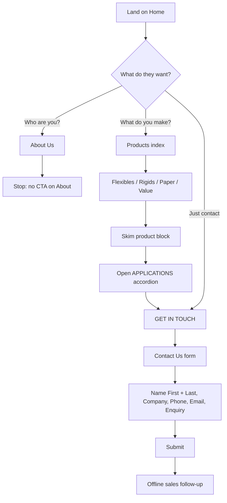
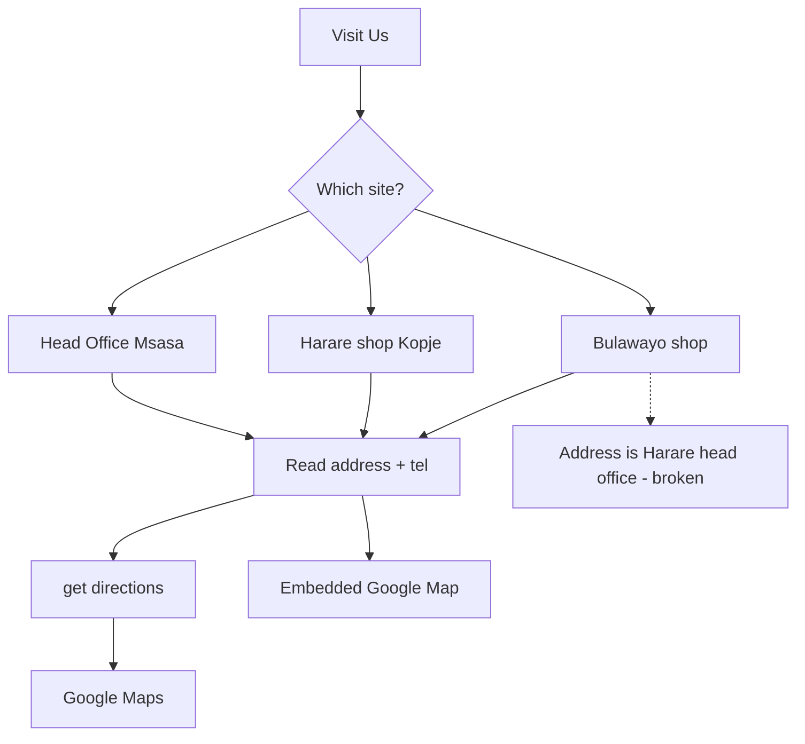

# Rawplast Industries — Current Website Copy Extract

Extracted: 11 September 2026
Source: https://rawplast.co.zw/
CMS: WordPress (Spectra / Ultimate Addons for Gutenberg), built early 2024. Last public page edit seen: Flexibles, 29 July 2024.
No blog posts. WooCommerce shop/basket/checkout/my-account pages exist but contain no marketing copy (shop appears empty).

Use this file as **source material for rewriting**, not as the voice to imitate. Keep product names, sizes, locations, legal names, and the company timeline unless a human has corrected them. Rewrite the marketing prose.

---

## How to use this file

1. **Facts inventory** (section 2) is the truth table. Prefer it over the page copy when they disagree.
2. **Page-by-page copy** (section 3) is what currently ships. Preserve structure of offerings; do not invent products that are not listed.
3. **Gaps and errors** (section 4) must be fixed or flagged in the new site, not copied.
4. Current voice is generic B2B: “versatile”, “elevate”, “precision”, “top-tier”, “seamless automation”. Do not reuse those fillers.
5. Legal trading name: **Rawplast Investments (Pvt) Ltd trading as Rawplast Industries**. Quality policy signs off as Rawplast Investments.
6. **User flows** (section 6) is how the live site actually works. Design the new IA against these jobs, not against the old page list alone.

---

## 1. Site map

| Page | URL | Browser title |
|---|---|---|
| Home | https://rawplast.co.zw/ | Rawplast Industries |
| About Us | https://rawplast.co.zw/about-us/ | About Us – Rawplast Industries |
| Products & Services | https://rawplast.co.zw/products/ | Products & Services – Rawplast Industries |
| Flexibles | https://rawplast.co.zw/products/flexibles/ | Flexibles – Rawplast Industries |
| Rigids | https://rawplast.co.zw/products/rigids/ | Rigids – Rawplast Industries |
| Paper | https://rawplast.co.zw/products/paper/ | Paper – Rawplast Industries |
| Value Added Services | https://rawplast.co.zw/products/value/ | Value Added Services – Rawplast Industries |
| Policies | https://rawplast.co.zw/policies/ | Policies – Rawplast Industries |
| Visit Us | https://rawplast.co.zw/visit-us/ | Visit Us – Rawplast Industries |
| Contact Us | https://rawplast.co.zw/contact-us/ | Contact Us – Rawplast Industries |
| Shop (empty) | https://rawplast.co.zw/shop/ | Shop – Rawplast Industries |

WordPress setting: `show_on_front = posts`, `page_on_front = 0`. Home is **not** a WP page; it is a custom front assembled from theme/block sections. There is no blog.

Inferred primary nav (menus API is locked; inferred from published marketing pages): About Us · Products · Policies · Visit Us · Contact Us. Products has four child pages and is the only hierarchy on the site.

Tagline / lockup line used on the home hero: **Total Packaging Solutions.**

---

## 2. Facts inventory

Treat this as the factual brief. Marketing sentences live in section 3.

### Company

- Headquartered in Zimbabwe; serves Zimbabwe and the SADC region.
- Started in flexible plastic packaging; later diversified into rigids, paper, and services.
- Sectors named on the site: food and beverages, mining, agriculture, health, construction.
- Values listed: Teamwork, Superior Service, Reliability, Innovation, Professionalism.
- Quality Assurance Department exists; food-contact packaging is treated as a food-safety item.
- Training topics named: GMPs, food defense, allergen management, sanitation, traceability.
- Third-party / customer / supplier audits are claimed.

### Timeline (About → Our Story)

| Period | Title on site | Facts claimed |
|---|---|---|
| 2005 | Rawplast Is Born | Rawplast Investments (Pvt) Ltd trading as Rawplast Industries registers and starts flexible plastic packaging production. |
| 2010–2013 | Expanding Horizons | Fleet of blown film extruders, bagmaking machines; starts flexographic printing. |
| 2014–2020 | Sustained Expansion and Sustainability Focus | More extruders and bagmakers; recycling plants; Bag-on-roll machine. |
| 2021 | Milestones and Technological Advancements | Factory tour; photopolymer printing plate maker; 8-colour flexo printing machine. |
| 2022–2023 | Regional Expansion and Technological Investments | Official opening of Bulawayo branch; further machinery. |

### Locations (Visit Us)

**Head Office**
- 1 Neil Avenue, Msasa, Harare, Zimbabwe
- Tel: +263 242 446801 / 26 / 46 / 55 / 60  (footer expands these as 446 801 / 826 / 846 / 855 / 860)
- VoIP: +263 86 7700 4597

**Harare Distribution Shop**
- 41 Harare Street, Kopje, Harare, Zimbabwe
- Tel: +263 242 783 267
- Telefax: +263 242 783 266
- Cell: +263 772 901 668

**Bulawayo Distribution Shop**
- Address currently published: 1 Neil Avenue, Msasa, Harare — **this is a copy-paste error; it is the Harare head-office address.** Do not reuse until confirmed.
- Tel/VoIP currently published: same as Head Office — likely also wrong.

### Footer contact block (repeated on every page)

Address:
- 1 Neil Avenue, Msasa, Harare, Zimbabwe

Telephone:
- +263 242 446 801 / 826 / 846 / 855 / 860

Cell phones (comma-separated on the live site):
- +263 773 715 211
- +263 783 279 462
- +263 789 499 763
- +263 713 464 830
- +263 789 499 761
- +263 713 464 837
- +263 785 762 543
- +263 712 767 574
- +263 789 499 762
- +263 713 464 828
- +263 716 372 086
- +263 789 117 707

VoIP:
- +263 86 7700 4597

Email:
- info@rawplast.com
- sales@rawplast.co.zw
- sales2@rawplast.com
- sales3@rawplast.com
- sales4@rawplast.com

Hours:
- Monday–Friday: 8am – 5pm
- Saturday: 8am – 2pm

### Customer logos on the home “Trusted by these brands” strip

Inferred from media filenames (no alt text on the site). Confirm before publishing names:

- Bata
- Dendairy
- Drummonds
- Irvines
- Khaya Cement
- Olivine
- Orgfert
- Polyoak
- Schweppes
- Universal Leaf

### Product catalogue (what the site actually lists)

**Flexible plastics**

| Offering | Also called / notes | Named types, sizes, or variants | Named applications |
|---|---|---|---|
| Flexible bag packaging | Homepage: “Plastic bag packaging” | Flat bags, gusset bags, pillow bags, standing pouch bags, pouch bags with zip fasteners | Zip lock bags; chicken bags; bags-on-a-roll; tobacco case liners; carrier bags; bin liners; planting pockets; bailer bags; shrink sleeves |
| Autopack sheeting | | Includes laminated autopack sheeting | Food packaging; beverage packaging (e.g. Maheu); clothing & textiles; pharmaceuticals; industrial goods |
| Shrinkwrap sheeting | | | Food; beverage; clothing & textiles; pharmaceuticals; industrial goods; transport & logistics; agricultural produce |
| Plastic sheeting | Homepage: “Clear & Coloured Plastic Sheeting”; also “Plastic covers” on the products index | Clear and coloured | Greenhouse sheeting; dam liners; pond liners; construction; roofing |
| Vinophane | Distinct from palletwrap/clingfilm | | Food; meat & poultry; gift packaging; beverages |
| Palletwrap / clingfilm | Machine and hand application. Explicit note: not to be confused with Vinophane | | Logistics; industrial manufacturing; warehousing |

**Rigid plastics**

| Offering | Sizes on site | Named applications |
|---|---|---|
| PET jars | 300ml, 330ml, 375ml | Food storage (dry goods, snacks, spices); cosmetic packaging; health supplements; craft/DIY storage |
| Refuse bins | 100L | Offices; public areas; commercial; residential; events |
| Plastic dessert cups | 12oz, 16oz | Catering; dessert shops; event planning; home entertaining; bakeries |
| Plastic food trays | none listed | Fast food; catering; school cafeterias; takeout/delivery; picnics/outdoor |
| Multi-purpose plastic containers | listed on home / products index only — **no product page copy** | — |
| Plastic spray bottles | listed on home / products index only — **no product page copy** | — |

**Paper**

| Offering | Notes |
|---|---|
| Paper cores / cardboard paper cores | Winding paper, film, textiles; textile industry; industrial packaging |
| Khaki covers | Listed on home and products index only — **no product page copy** |

**Value-added services**

| Offering | Site name variants | What the copy claims |
|---|---|---|
| Lithographic plate making | About timeline instead describes a **photopolymer plate maker** and **flexographic** printing | Plates for commercial printing, fine art, labels/packaging, newspapers/magazines, corporate collateral |
| Winding & slitting | Home/index: “Slitting & Rewinding” | Slitting, rewinding, unwinding for food packaging, medical films, label printing, industrial wrapping, pharmaceuticals |
| Recycling | | Converts flexible plastic waste into plastic granules for reuse |
| Packaging graphic design | | Designs for food/snacks, personal care, beverages, health/wellness, household products |

---

## 3. Page-by-page copy

Verbatim marketing text from the live site. Footer is omitted here (see section 2).

### Home — `/`

**Hero**
- Eyebrow / H1 style: Total Packaging Solutions.
- We specialize in manufacturing high-quality packaging solutions tailored for diverse industries and applications.
- We invite you to collaborate with us on your next project to achieve mutual success.

**About teaser**
- Heading: About Us
- We are committed to delivering top-tier packaging solutions, we ensure our high-quality offerings play a pivotal role in advancing the success of your business.
- CTA: learn more → `/about-us/`

**Products teaser**
- Heading: Products & Solutions
- We craft packaging solutions that drive your business forward.

Slides / cards:

- Flexible Plastics — Plastic bag packaging; Plastic covers; Shrinkwrap sheeting; Palletwrap/Clingfilm; Clear & Coloured Plastic Sheeting
- Rigid Plastics — Multi-purpose plastic containers; PET Jars; Refuse bins; Plastic spray bottles; Plastic dessert cups
- Paper — Cardboard paper cores; Khaki covers
- Value Added Services — Slitting & Rewinding; Lithographic Plate Making; Packaging Graphic Design; Recycling

**Social proof**
- TRUSTED BY THESE BRANDS
- We are trusted by leading brands for premium packaging solutions.
- Logo wall (names inferred from image files; see section 2)

**Closing CTA**
- GET IN TOUCH
- Heading: Have a question?
- Count on our sales consultants to guide you in discovering the ideal packaging solutions for your business needs.
- CTA: contact us → `/contact-us/`

### About Us — `/about-us/`

Eyebrow: WHO WE ARE
H1: About Us

**Evolution of Excellence**
- Rawplast Industries, headquartered in the Republic of Zimbabwe, is a leading packaging solutions provider. The company’s history traces back to its initial focus on the distribution and manufacturing of flexible plastic packaging products. However, recognizing the evolving needs of its clientele, Rawplast Industries has undergone strategic diversification to expand its service offerings.
- In addition to flexible plastic packaging, the company now provides a comprehensive range of packaging solutions. The applications of Rawplast Industries’ packaging- solutions are extensive and span diverse industrial sectors. These sectors include, but are not limited to, food and beverages, mining, agriculture, health, and construction. Rawplast Industries continues to position itself as a key player in the packaging industry, offering innovative solutions that contribute to the success and efficiency of businesses across various sectors in Zimbabwe and in the SADC region.

**Values**
- Guided by core values, Rawplast Industries aims for honest and integral business practices, fostering mutually beneficial relationships with clients, suppliers, and stakeholders for sustained growth and profitability.

- Teamwork — Valuing our human resources above all, we harness diverse skills to achieve corporate goals collectively.
- Superior Service — Customers are our focal point, propelling our unwavering commitment to satisfaction in every endeavor.
- Reliability — At Rawplast Industries, our commitment to delivering high-quality service is unwavering.
- Innovation — We consistently explore innovative avenues to enhance value for our stakeholders—customers, suppliers, bankers, shareholders, and employees alike
- Professionalism — Upholding the pinnacle of professionalism, we embody sound business ethics, fairness, honesty, and integrity in all our business relationships.

**Our Story**
- Subhead: Rawplast Industries’ Journey Through Time.
- Timeline entries: see Facts inventory.

### Products index — `/products/`

Eyebrow: WHAT WE DO
H1: Products & Solutions
- Explore our diverse range of packaging solutions.

**Flexible Plastics** — learn more → `/products/flexibles/`
- Plastic bag packaging
- Plastic covers
- Shrinkwrap sheeting
- Palletwrap/Clingfilm
- Clear & Coloured Plastic Sheeting

**Rigid Plastics** — learn more → `/products/rigids/`
- Multipurpose plastic containers
- Refuse bins
- Plastic spray bottles
- Plastic dessert cups

**Paper** — learn more → `/products/paper/`
- Cardboard paper cores
- Khaki covers

**Value Added Services** — learn more → `/products/value/`
- Slitting & Rewinding
- Lithographic Plate Making
- Packaging Graphic Design
- Recycling

Note: PET jars appear on the home rigid card but **not** on this index list. Food trays appear on the Rigids page but **not** here.

### Flexibles — `/products/flexibles/`

Eyebrow: PACKAGING SOLUTIONS
H1: Flexible Plastics
Repeated CTA on each block: GET IN TOUCH

**Flexible Bag Packaging**
- We offer a diverse selection of packaging solutions, ranging from flat bags, gusset bags, pillow bags, and standing pouch bags to pouch bags with zip fasteners, all designed to cater to your product needs.
- Applications: Zip lock bags; Chicken bags; Bags-on-a-roll; Tobacco case liners; Carrier bags; Bin liners; Planting pockets; Bailer bags; Shrink sleeves

**Autopack Sheeting**
- This versatile packaging solution ensures seamless automation, offering reliability and precision. From enhancing product presentation to optimizing storage, autopack sheeting is a reliable choice for streamlined and efficient packaging processes. Our portfolio also includes laminated autopack sheeting.
- Applications: Food packaging; Beverage packaging (e.g. Maheu); Clothing & Textiles; Pharmaceuticals; Industrial Goods

**Shrinkwrap Sheeting**
- This dynamic packaging solution guarantees effortless automation, providing consistent reliability and precision in every shrinkwrapped item. From elevating product presentation to space-efficient storage optimization, shrinkwrap sheeting stands as a dependable choice for streamlined and efficient packaging processes.
- Applications: Food packaging; Beverage packaging; Clothing & Textiles; Pharmaceuticals; Industrial Goods; Transport & Logistics; Agricultural produce

**Plastic Sheeting**
- This versatile plastic sheeting solution provides a multitude of applications with its clarity and vibrant color options. Whether you need transparent protection or want to add a splash of color to your packaging, our clear and colored plastic sheeting ensures adaptability and reliability in every use
- Applications: Greenhouse sheeting; Dam liners; Pond liners; Construction; Roofing

**Vinophane**
- Vinophane stands as a versatile and elegant solution for your packaging needs, offering a touch of sophistication.
- Applications: Food; Meat & Poultry; Gift packaging; Beverages

**Palletwrap/Clingfilm**
- Palletwrap also known as Clingfilm is a robust packaging solution, ensures seamless automation with unwavering reliability and precision in each wrap. From securing goods during transit to optimizing warehouse storage, Palletwrap stands as a dependable choice for efficient and organized packaging processes. *Available in both Machine and Hand Applications: Whether you prefer the speed of machine application or the control of hand wrapping, our palletwrap is available in both options to cater to your specific requirements.
- *Not to be confused with Vinophane
- Applications: Logistics; Industrial Manufacturing; Warehousing

### Rigids — `/products/rigids/`

Eyebrow: PACKAGING SOLUTIONS
H1: Rigids
Repeated CTA: GET IN TOUCH

**PET Jars**
- Our PET jars combine clarity and durability, providing a versatile packaging solution for a range of products. These jars are crafted from high-quality PET plastic, offering a crystal-clear appearance that showcases the contents while ensuring protection and freshness. Available sizes: 300ml,330ml,375ml
- Applications:
  - Food Storage: Ideal for storing dry goods, snacks, and spices, keeping them visible and well-preserved.
  - Cosmetic Packaging: Showcases beauty and skincare products attractively, allowing customers to see the colors and textures.
  - Health Supplements: Ensures the integrity of vitamins, pills, and powders with a secure and transparent PET jar.
  - Craft and DIY Storage: Perfect for organizing beads, buttons, and other craft supplies, offering easy visibility.

**Refuse Bins**
- Durable and sleek bins for effective waste management. From offices to public spaces, our refuse bins blend functionality with style. Available size(s): 100L
- Applications:
  - Office Spaces: Maintain cleanliness and organization.
  - Public Areas: Encourage responsible waste disposal.
  - Commercial Establishments: Ensure a tidy and hygienic environment.
  - Residential Use: Streamline household waste disposal.
  - Events and Gatherings: Facilitate efficient waste collection.

**Plastic Dessert Cups**
- Elevate dessert presentations with our premium plastic cups. Ideal for diverse occasions, adding a touch of elegance to sweet treats.
- Available size(s): 12oz, 16oz
- Applications:
  - Catering Events: Enhance dessert displays at weddings and parties.
  - Dessert Shops: Showcase delectable treats with clarity and style.
  - Event Planning: Perfect for organized gatherings and celebrations.
  - Home Entertaining: Impress guests with stylish and disposable dessert servings.
  - Bakeries: Present baked goods attractively with these versatile cups.

**Plastic Food Trays**
- Versatile trays for efficient and organized food service. Ideal for fast-food, catering, takeout, delivery, picnics, and outdoor events.
- Applications:
  - Fast Food Restaurants: Streamline serving and maintain order.
  - Catering Services: Enhance food presentation at events.
  - School Cafeterias: Facilitate organized meal service for students.
  - Takeout and Delivery: Ensure secure and convenient food packaging.
  - Picnics and Outdoor Events: Provide a practical and portable dining experience.

### Paper — `/products/paper/`

Eyebrow: PACKAGING SOLUTIONS
H1: Paper

**Paper Cores** (only product with copy on this page)
- Durable and versatile, our paper cores provide reliable strength for various applications. A sustainable choice for winding materials, offering stability and support.
- Applications:
  - Rolling Materials: Ideal for winding materials like paper, film, and textiles.
  - Textile Industry: Supports fabric rolls during production and transportation.
  - Industrial Packaging: Ensures stability in packaging for various industries.
- CTA: GET IN TOUCH

Khaki covers are not described here.

### Value Added Services — `/products/value/`

Eyebrow: PACKAGING SOLUTIONS
H1: Value Added Services
Repeated CTA: GET IN TOUCH

**Lithographic Plate Making**
- Precision meets artistry in our lithographic plate making service. We expertly prepare plates for vibrant and detailed prints, merging chemistry and craftsmanship.
- Applications:
  - Commercial Printing: Ideal for high-volume production of brochures, catalogs, and packaging.
  - Fine Art Reproduction: Capture intricate details in art prints with the precision of lithographic plates.
  - Label and Packaging: Ensure sharp and vibrant packaging designs for products.
  - Newspaper and Magazine Printing: Achieve consistent and high-quality prints for publications.
  - Corporate Collateral: Enhance the professional image of business cards, letterheads, and more.

**Winding & Slitting**
- Precision in flexible packaging solutions. Our expertise ensures efficient slitting, rewinding, and unwinding for diverse applications.
- Applications:
  - Food Packaging: Custom sizes for sealing freshness.
  - Medical Films: Precision for sterile packaging.
  - Label Printing: Accurate slitting for vibrant labels.
  - Industrial Wrapping: Tailored rolls for efficient use.
  - Pharmaceuticals: Reliable slitting for pharmaceutical films.

**Recycling**
- Pioneering the green revolution, we repurpose flexible plastic waste into top-notch plastic granules. These granules serve as the building blocks for crafting a wide array of plastic products, promoting a circular and sustainable approach to materials.

**Packaging Graphic Design**
- Elevate your brand with innovative and eye-catching designs. Tailored solutions for versatile and impactful flexible packaging.
- Applications:
  - Food and Snacks: Engaging designs for enticing product presentation.
  - Personal Care Products: Attractive packaging to enhance brand appeal.
  - Beverages: Captivating labels for beverage containers.
  - Health and Wellness: Informative and visually appealing packaging for supplements.
  - Household Products: Customized designs for household items.

### Policies — `/policies/`

H1: Policies

**Quality Assurance Policy**
- We are dedicated to manufacturing and delivering quality products aligned with customer needs at affordable prices, ensuring competitive returns for all stakeholders. We consistently strive to surpass customer expectations. Quality improvement is a core focus, empowering each employee to excel in their roles. We commit to complying with and enhancing our quality management system by valuing key principles:
  - Collaboration with suppliers for seamless quality processes.
  - Encouraging staff to actively engage in quality improvement through teamwork, integrity, fairness, professionalism, and ethical practices.
  - Individual responsibility for comprehending and applying the quality policy.
  - Adherence to applicable statutory and regulatory requirements.
  - Establishing and reviewing quality objectives across departments regularly.
- Our quality policy undergoes periodic reviews to ensure its ongoing suitability, reflecting our commitment to continual improvement and leadership by example at Rawplast Investments.

**Food Safety Policy**
- At Rawplast Industries, we consider plastic packaging a vital element in ensuring food safety, treating it as a crucial component that directly interacts with food. Our commitment aligns with regulatory standards, employing thorough control points, vulnerability analyses, and verifications. Regular audits by customers, suppliers, and other stakeholders validate our adherence to high food safety practices. Recognizing the importance of robust quality programs, we invest in people, processes, and systems. Our dedicated Quality Assurance Department oversees food safety and packaging quality. Ongoing training covers GMPs, food defense, allergen management, sanitation, and traceability. We maintain meticulous records, welcome third-party audits, and ensure prompt access to packaging material information for customers. Committed to quality and food safety, this policy undergoes regular reviews to align with our company’s goals.

### Visit Us — `/visit-us/`

Eyebrow: OUR LOCATIONS
H1: Visit Us
- Experience our customer-centric approach and discover tailored solutions for your packaging requirements. We look forward to welcoming you.

Location cards (each has a “get directions” link and an embedded Google Map):

- Head Office — 1 Neil Avenue, Msasa Harare, Zimbabwe. Tel: +263 242 446801/26/46/55/60. VoIP: +263 86 7700 4597. Map query: “rawplast industries pvt ltd”
- Harare Distribution Shop — 41 Harare Street, Kopje Harare, Zimbabwe. Tel: +263 242 783 267. Telefax: +263 242 783 266. Cell: +263 772 901 668. Map query: “rawplast distribution harare”
- Bulawayo Distribution Shop — 1 Neil Avenue, Msasa Harare, Zimbabwe. Tel: +263 242 446801/26/46/55/60. VoIP: +263 86 7700 4597. Map query: “rawplast bulawayo”

### Contact Us — `/contact-us/`

H1: Contact Us
- We value your interest and are eager to assist you in finding the perfect packaging solutions tailored to your unique needs.
- Fill out the form. This allows us to better understand your requirements before getting in touch with you.

**Form (WPForms)**
- Name * (First, Last)
- Company *
- Phone Number *
- Email *
- Enquiry *
- Button: Submit

---

## 4. Gaps, inconsistencies, and rewrite flags

Do not copy these into the new site without a human check.

1. **Bulawayo address is wrong on the live site.** It repeats the Harare head office. The map search string is “rawplast bulawayo”, so the intent is a real Bulawayo location.
2. **Plate making:** product copy says “lithographic”; company story says photopolymer plates and 8-colour **flexo**. For a packaging printer this is almost certainly flexo / photopolymer, not litho. Confirm with production before publishing.
3. **Naming drift across pages:**
   - Plastic covers (index) vs Vinophane (flexibles page) vs Plastic sheeting
   - Slitting & Rewinding (home/index) vs Winding & Slitting (service page)
   - Products & Services (WP title) vs Products & Solutions (on-page H1)
   - Multipurpose vs Multi-purpose plastic containers
4. **Offerings listed but never described:** khaki covers; plastic spray bottles; multi-purpose plastic containers.
5. **Offerings described but missing from the products index:** PET jars (missing on `/products/`); plastic food trays (missing on home and `/products/`).
6. **Rigid application copy is generic / possibly off-market** (craft DIY storage, school cafeterias, weddings). Ground new copy in actual Rawplast customers (bread, poultry, tobacco, beverages, cement, etc.).
7. **Home logo wall has no accessible names.** Brands above are inferred from filenames only.
8. **Twelve cell numbers in the footer** with no names/roles. New site should probably split sales vs switchboard vs shops.
9. **Email domains mix** `@rawplast.com` and `@rawplast.co.zw`.
10. **Shop is a dead WooCommerce install.** Decide whether the new site sells online or is enquiry-only.
11. **No careers, no news, no spec sheets, no downloadable quality certs** on the current site.
12. **About body has a hyphen glitch:** “packaging- solutions”.
13. **Palletwrap sentence is grammatically broken:** “Palletwrap also known as Clingfilm is a robust packaging solution, ensures…”
14. **Dessert cups copy had a broken animation tag** in the CMS (`Enhance dessert displays…`).

---

## 5. What is worth keeping vs rewriting

**Keep (facts / differentiators)**
- Make-to-order flexible packaging manufacturer in Zimbabwe / SADC
- Bag types: flat, gusset, pillow, standing pouch, zip pouch
- Local SKUs: chicken bags, tobacco case liners, planting pockets, bailer bags, Maheu autopack, bags-on-a-roll
- Laminated autopack
- Vinophane vs palletwrap distinction (machine and hand)
- PET jar sizes 300 / 330 / 375 ml; dessert cups 12oz / 16oz; 100L bins
- In-house recycling to granules
- In-house print / plate making / graphic design / slitting
- 2005 origin; flexo; 8-colour press; Bulawayo branch; Msasa factory; Kopje shop
- Food-safety policy substance (QA department, GMPs, allergens, traceability, audits)
- Tagline “Total Packaging Solutions” if brand still wants it (it is also on the logo lockup)

**Rewrite (voice)**
Almost all headlines and body paragraphs. The 2024 site reads like theme-demo industrial copy. New copy should sound like a Harare factory that already supplies named brands, not a generic packaging catalogue.

**Suggested prompt stub for a copy LLM**

> You are rewriting the public website for Rawplast Industries, a make-to-order flexible packaging manufacturer in Zimbabwe. Use `rawplast_website_copy.md` as the source of current offerings, facts, and live user flows. Do not invent products. Do not copy the old adjectives. Prefer concrete Zimbabwe/SADC uses (bread bags, chicken bags, tobacco liners, Maheu, cement, retail carriers) over generic global applications. The live site is enquiry-only; do not design an ecommerce checkout unless asked. Flag anything in section 4 that still needs a human fact-check. Write [page / section].

---

## 6. User flows (live site)

Mapped 14 September 2026 from the public pages and WordPress API. Button `href` attributes are stripped in the public HTML-in-JSON, so destinations below are the only matching pages on the site (e.g. every **GET IN TOUCH** / **contact us** CTA can only go to `/contact-us/`). Header menu order could not be read from the menus API (401).

The site is a **brochure + enquiry** site, not a shop. There is no quote builder, no spec download, no product-level URL, and no live chat beyond a WhatsApp widget.

### 6.1 Jobs the live site can actually finish

| Visitor job | Path that exists | How it ends |
|---|---|---|
| Learn who Rawplast is | Home → About Us | Read company story / values / timeline. **No CTA on About.** |
| See whether they make a product | Home or Products index → one of four category pages → open **APPLICATIONS** accordion | Read copy. Next step is enquiry, not a spec or SKU. |
| Send an enquiry / “get a quote” | Any **GET IN TOUCH** or **contact us** → Contact form | WPForms submit. Sales follow-up is offline. |
| Find a factory or shop | Visit Us | Address + embedded map + **get directions** (Google). |
| Call or email | Footer on every page | Phone list and five email addresses. |
| Message on WhatsApp | Floating widget (QuadLayers account “Rawplast”, added 28 Jul 2024) | Opens WhatsApp. Number is not exposed in the public API. |
| Buy online | `/shop/`, `/basket/`, `/checkout/`, `/my-account/` | **Dead end.** Shop has no products; basket renders “Your basket is currently empty!” |

### 6.2 Chrome on every page

Always available, regardless of page:

- **Logo** → home (`/`)
- **Header nav** (inferred): About Us, Products & Services, Policies, Visit Us, Contact Us
- **Footer:** Msasa address, switchboard, 12 cell numbers, VoIP, 5 emails, Mon–Fri 8am–5pm / Sat 8am–2pm, a **Social** block (icon-only; no accessible network names in the text extract)
- **WhatsApp** floating button (site-wide plugin, not a page)

Not present: site search (requesting `/?s=` returns 403), blog, FAQ, careers, language switcher, account/login in the marketing IA.

### 6.3 Information architecture

```text
Home (/)                          custom front, not a WP page
├── About Us
├── Products & Services           parent of the four category pages
│   ├── Flexibles                 bags, autopack, shrinkwrap, sheeting, vinophane, palletwrap
│   ├── Rigids                    PET jars, bins, dessert cups, food trays
│   ├── Paper                     paper cores only (khaki covers listed but not described)
│   └── Value Added Services      plates, slitting, recycling, graphic design
├── Policies                      QA + food safety. No CTA.
├── Visit Us                      3 location cards
├── Contact Us                    the only conversion form
└── leftover WooCommerce          /shop /basket /checkout /my-account
```

There are **no URLs per SKU**. “Chicken bags” and “Maheu autopack” live inside accordion copy on `/products/flexibles/`. A visitor cannot deep-link or share them.

### 6.4 Flow A — Primary conversion: browse then enquire

This is the path the page templates are built for.



**Home**

1. Hero (“Total Packaging Solutions”) — no button in the extracted hero; the next visible actions are further down the page.
2. About teaser → **learn more** → `/about-us/`
3. Products slider/cards listing the four categories (home extract did not show per-card buttons; the dedicated products index does).
4. Logo wall — not clickable as brands (images, no alt text).
5. Closing band **Have a question?** → **contact us** → `/contact-us/`

**Products index** (`/products/`)

Four cards, each with a bullet list and **learn more**:

| Card | Goes to |
|---|---|
| Flexible Plastics | `/products/flexibles/` |
| Rigid Plastics | `/products/rigids/` |
| Paper | `/products/paper/` |
| Value Added Services | `/products/value/` |

PET jars and food trays are **missing from this index** (they only appear on the Rigids page / home). Khaki covers, spray bottles, and multi-purpose containers are listed here but have **no product block** on the destination page.

**Category page** (repeated pattern on Flexibles, Rigids, Paper, Value)

For each offering:

1. Image (gallery on Rigids; single figure on Flexibles/Paper/Value)
2. Product name + paragraph
3. Optional size line (jars, bins, cups only)
4. Collapsed **APPLICATIONS** `<details>` — visitor must click to see the useful SKU list
5. **GET IN TOUCH** → `/contact-us/`

CTA count: Flexibles ×6, Rigids ×4, Paper ×1, Value ×4. Every button does the same thing. None pre-fill the form with the product they were looking at.

**Contact form** (`/contact-us/`, WPForms id 925)

- Requires JavaScript (“Please enable JavaScript in your browser to complete this form.”)
- All fields required: First name, Last name, Company, Phone, Email, Enquiry
- Button: **Submit** (styled Rawplast red `#d63637`)
- No product dropdown, no quantity, no file upload for artwork, no “which branch”
- Success / error states are plugin defaults (not custom copy on the page)

### 6.5 Flow B — Visit / get directions



- Three cards, each: title, address, phones, **get directions**, Spectra Google Map embed.
- Map queries: `rawplast industries pvt ltd` · `rawplast distribution harare` · `rawplast bulawayo`
- **get directions** is a separate control from the embed; both are Google.
- Bulawayo card is a copy-paste of Msasa, so this flow **fails for Bulawayo** even though the map query is different.
- No “book a factory tour” action, despite 2021 timeline mentioning a factory tour.

### 6.6 Flow C — Direct contact without browsing

From any page, skip products:

1. Header **Contact Us**, or
2. Footer email / phone / VoIP, or
3. WhatsApp widget

There is no “call sales” vs “call the shop” labelling. The Kopje shop number only appears on Visit Us, not in the global footer. The footer dumps twelve cells with no names.

### 6.7 Flow D — Broken or leftover commerce

WooCommerce pages were created 17 May 2024. They are not in the marketing IA but they resolve:

| URL | What the visitor sees |
|---|---|
| `/shop/` | Title only. No products. Footer. |
| `/basket/` | “Your basket is currently empty!” plus “You may be interested in…” / “New in store” (empty). |
| `/checkout/` | Empty checkout chrome. |
| `/my-account/` | WooCommerce account shortcode (login/register if the plugin is live). |

Nothing on a product page adds to cart. A visitor who guesses `/shop/` cannot complete a purchase.

### 6.8 Other URLs that exist but are not journeys

| URL | Behaviour |
|---|---|
| `/author/tendaikatiyo/` | “No posts were found.” |
| `/?s=…` | 403 (search is blocked) |
| Unknown slug | 404 |
| `/whatsapp-accounts/rawplast/` | Plugin CPT permalink; renders like the front, not a useful page |
| `/policies/` | Read-only. No download, no “request a certificate” |

### 6.9 What the live flows do not support (gaps for the new site)

These are jobs a packaging buyer actually has, and the 2024 site cannot complete:

1. **Request a quote on a specific SKU** — form does not know they came from “chicken bags” or “330ml PET jar”.
2. **Send artwork / dimensions / Pantone** — no file upload.
3. **Choose Harare factory vs Kopje shop vs Bulawayo** — not a form field; Bulawayo data is wrong anyway.
4. **Download a spec, food-contact letter, or QA policy PDF** — policies are HTML only.
5. **Land on a product from Google** — no SKU pages, so search would have to rank the long category page.
6. **Self-serve retail at the distribution shops** — hours and address only; no stock list.
7. **Careers / tender / supplier onboarding.**
8. **Account or order status** — my-account is an unused shop leftover.

### 6.10 Implications for the redo

- Keep **one primary conversion**: talk to sales. Do not resurrect WooCommerce unless the business now wants a catalogue with prices.
- Give **each real offering a URL** (or at least an in-page id) so GET IN TOUCH can carry context, and so chicken bags / tobacco liners / Maheu are findable.
- Put a CTA on **About** and **Policies**; today those are dead ends.
- Split **factory vs shops** in contact and visit flows; fix Bulawayo before cloning Visit Us.
- Treat Applications accordions as the actual product index — they hold the SKUs buyers recognise. The new IA should promote those names, not hide them behind a click.
- Homepage is a long single-scroll pitch (hero → about → products → logos → contact). The new home can keep that funnel; it does not need a shop, blog, or mega-menu.
